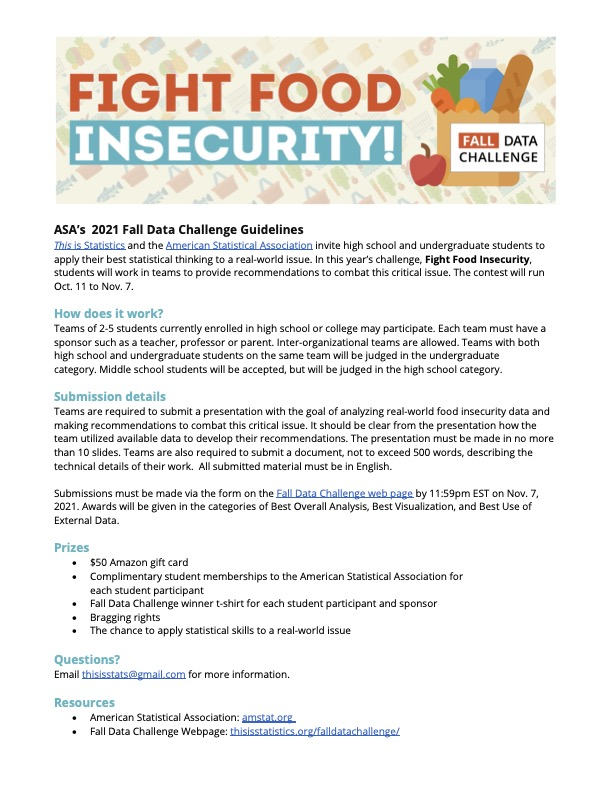

The Fall Data Challenge (https://thisisstatistics.org/falldatachallenge/) starts next Monday on October 11th. This is a GREAT opportunity for students to

* apply statistical and data wrangling skills to important real-world issues and make recommendations to combat this critical issue
* compete for prizes, T-shirts & bragging rights
* Practice for [DataFest](https://chicodatafest.netlify.app/) in the Spring!

This is a team event open to all majors. We welcome pre-formed teams as well as individuals! There will be a kickoff event Monday 10/11 night where teams can be formed. Late joins are also welcome! 

Please see attached flier for more information. If you are interested, please contact Robin Donatello at rdonatello@csuchico.edu. 

