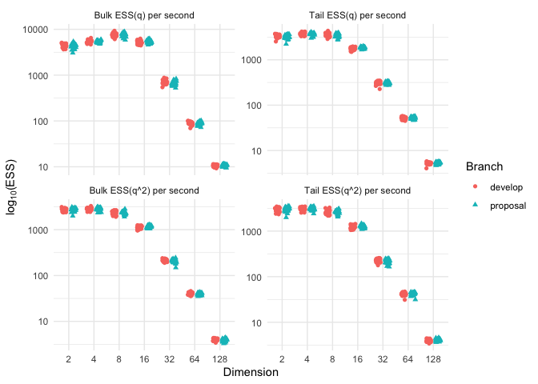
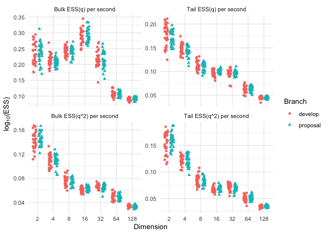
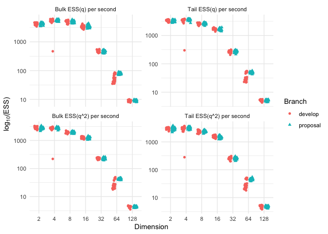
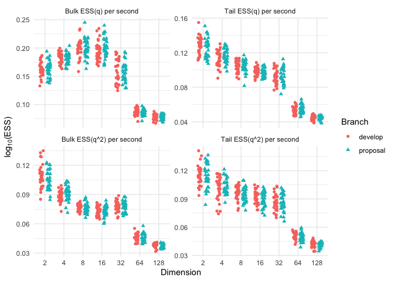
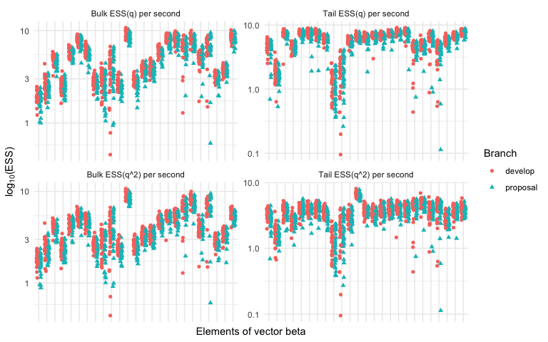
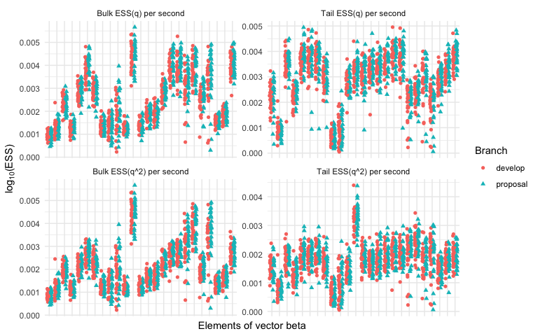

-   [Abstract](#abstract)
-   [Introduction](#introduction)
-   [Proposed Dynamics](#proposed-dynamics)
-   [Numerical Experiment](#numerical-experiment)
-   [Discussion](#discussion)
-   [License](#license)
-   [References](#references)

### Abstract

This technical report analyzes two mathematically equivalent versions of
Hamiltonian dynamics within the Hamiltonian Monte Carlo (HMC) algorithm
as implemented in the probabilistic programming language
[Stan](https://mc-stan.org/). This report compares Stan’s HMC dynamics
to an alternative writing of the same dynamics, both under the dense
Euclidean metric. While the proposed reframing of Hamiltonian dynamics
reduces the number of calculations within the HMC algorithm, there is no
tangible reduction in the run time of the overall sampler for the tested
target distributions. This is likely due to the fact that gradient
evaluations of the target distributions dominate the run time.

Introduction
============

This technical report analyzes two mathematically equivalent versions of
Hamiltonian dynamics within the Hamiltonian Monte Carlo (HMC) algorithm
as implemented in the probabilistic programming language
[Stan](https://mc-stan.org/). This report compares Stan’s HMC dynamics
to an alternative writing of the same dynamics, both under the dense
Euclidean metric, but does not attempt to explain Hamiltonian Monte
Carlo. For a thorough introduction to HMC, consider Michael Betancourt’s
[A Conceptual Introduction to Hamiltonian Monte
Carlo](https://arxiv.org/abs/1701.02434) and Radford Neal’s [MCMC using
Hamiltonian dynamics](https://arxiv.org/abs/1206.1901). While the
proposed dynamics reduce the number of calculations within the HMC
algorithm, there is no tangible reduction in the run time of the overall
sampler for the tested target distributions. This is likely due to the
fact that the majority of the HMC run time is dominated by the cost of
leapfrog steps, which involve costly gradient evaluations of the target
distribution.

This report first describes the dynamics as currently implemented in
Stan v2.23.0, then describes the proposed dynamics. A simulation study
is carried out in the section Numerical Experiments, and a short
discussion of the results and of potential future research concludes the
report.

Proposed Dynamics
=================

Let *π*(*q*) ∝ exp ( − *U*(*q*)) be the target distribution of interest
for parameters *q* ∈ ℝ<sup>*d*</sup>. As of 2020-06-16, the [Stan GitHub
branch develop](https://github.com/stan-dev/stan) contains a version of
HMC that is written as the Hamiltonian

$$ H\_{dv}(q, p) = U(q) + \\frac{1}{2} p^T M^{-1} p, $$

where the subscript *d**v* stands for develop and
*M*<sup> − 1</sup> ≈ 𝔼<sub>*π*</sub>(*q* − *μ*)(*q* − *μ*)<sup>*T*</sup>
is dense *d* × *d* matrix. Under this scheme, the momenta follow a
multivariate Normal distribution, *p* ∼ *N*(0, *M*).

The work of Ma, Chen, and Fox (2015), in [A Complete Recipe for
Stochastic Gradient MCMC](https://arxiv.org/abs/1506.04696), suggests a
richer framework than presented below[1]. In an effort to simplify Ma’s
notation, some of their terms, that will drop out from this proposal
eventually anyway, have been removed.

Let *z* = (*q*, *p*). Ma et al.’s framework dictates dynamics as

*d**z* =  − *Q*(*z*)∇*H*(*z*)

where *Q* is any skew symmetric matrix. Some choices of *Q* will lead to
faster convergence than others. This proposal maintains
*M*<sup> − 1</sup> as a pre-conditioner, but incorporates it into *Q*
instead of in the distribution of the momenta.

In the notation of Ma’s framework, branch develop’s version of HMC is
carried out as follows. Draw *p* ∼ *N*(0, *M*), necessitating a Cholesky
decomposition *L**L*<sup>*T*</sup> = *M*<sup> − 1</sup> and a solve().
This was chosen by design because *M*<sup> − 1</sup> itself is needed in
the next step, and it’s expensive to keep both *L* and
*M*<sup> − 1</sup> in memory. With *p* in hand and

$$Q(z) = \\begin{bmatrix} 0 && -I \\\\ I && 0 \\end{bmatrix}$$

update *z* according to the dynamcis

$$ \\mathrm{d}z = -Q(z) \\nabla H(z) = -\\begin{bmatrix} 0 && -I \\\\ I && 0 \\end{bmatrix} \\begin{bmatrix} \\nabla U(q) \\\\ M^{-1}p \\end{bmatrix} = \\begin{bmatrix} M^{-1}p \\\\ -\\nabla U(q) \\end{bmatrix}.$$

Stan appproximates the dynamics of this Hamiltonian system in time *t*
using the [leapfrog
integrator](https://en.wikipedia.org/wiki/Leapfrog_integration), which
moves in steps of size *ϵ*.

Combining the first two steps into one and writing
*L**L*<sup>*T*</sup> = *M*<sup> − 1</sup>, we see that *q* is updated as

$$q\_{t + \\epsilon} = q\_{t} + \\epsilon LL^T p\_{t} - \\frac{\\epsilon^2}{2} LL^T \\nabla U(q\_{t}) $$

where *p* ∼ *N*(0, (*L**L*<sup>*T*</sup>)<sup> − 1</sup>) implies that
*L**L*<sup>*T*</sup>*p* ∼ *N*(0, *L**L*<sup>*T*</sup>).

Now consider the proposed version of HMC, where *p* ∼ *N*(0, *I*) gives
a slightly different Hamiltonian,

$$H\_{pr}(z) = U(q) + \\frac{1}{2}p^Tp.$$

Take

$$ Q(z) = \\begin{bmatrix} 0 && -L^T \\\\ L && 0 \\end{bmatrix} $$

where *L**L*<sup>*T*</sup> = *M*<sup> − 1</sup>. Since
*M*<sup> − 1</sup> is only updated at the end of each [adaption
window](https://mc-stan.org/docs/2_23/reference-manual/hmc-algorithm-parameters.html#adaptation.figure),
*L* is fixed throughout sampling. There is no need for
*M*<sup> − 1</sup> itself while sampling, not even to generate new
momenta *p*. Hence there is no solve() under this proposed scheme during
the sampling phase of Stan’s sampler.

The rest of this write up ensures that the other pieces of the
Hamiltonian Monte Carlo algorithm are updated apppropriately to the
modified Hamiltonian just presented.

The proposed dynamics then follow

$$ \\mathrm{d}z = \\begin{bmatrix} L^{T}p \\\\ -L \\nabla U(q) \\end{bmatrix}.$$

Using the same leapfrog integrator, the one step update of *q* is

$$ q\_{t + \\epsilon} = q\_{t} + \\epsilon L p\_{t} - \\frac{\\epsilon^2}{2}LL^T \\nabla U(q\_{t}). $$

Under this proposal, since *p* ∼ *N*(0, *I*), we have that
*L**p* ∼ *N*(0, *L**L*<sup>*T*</sup>) just as in the one step update of
*q* under branch develop.

The last necessary change is to measure distance appropriately under the
proposed Hamiltonian *H*<sub>*p**r*</sub>. In develop, and using the
notation of Betancourt (2017),

*q*<sub>+</sub>(𝔱) − *q*<sub>−</sub>(𝔱) = ∫<sub>*t* = 0</sub><sup>*t* = *T*(𝔱)</sup>*d**t**M*<sup> − 1</sup> ⋅ *p*(*t*).

Under the proposal, replace *M*<sup> − 1</sup> with *I*, since
*p* ∼ *N*(0, *I*) instead of *p* ∼ *N*(0, *M*). This ensures distance is
measured with respect to the appropriate metric and the Hamiltonian
*H*<sub>*p**r*</sub> is appropriately calculated.

Computational Savings Under Proposed Dynamics
---------------------------------------------

Under the proposed dynamics, there is no decomposition nor solve() while
sampling, which otherwise occurs once for each transition at a cost of
roughly *d*<sup>3</sup>/3 and *d*<sup>2</sup> operations respectively.
However, since generating *p* and calculating *L**p* is as costly as a
solve(), once the decomposition is already performed, there is no net
gain from foregoing the solve() step. Theoretically, this proposal could
take advantage of storing only *L*, which is lower triangular. Further,
with no decomposition, the proposed dynamics should also consume less
memory. This report makes no attempt at measuring the effects on memory
consumption due to the proposed dynamics. For each transition, the net
savings in computational cost is one decomposition with approximate cost
*d*<sup>3</sup>/3.

Since the leapfrog integrator takes two half-steps to update the
momenta, *L*∇*U*(*q*) is calculated twice within one complete leapfrog
step under the proposed dynamics, once for each half-step. This
matrix-vector multiplication can be made more efficient in
[Eigen](http://eigen.tuxfamily.org/index.php?title=Main_Page) since *L*
is lower triangular[2].

Beyond the evaluation of ∇*U*, which is addressed below, the difference
in computational cost for each leapfrog integration between proposal and
develop comes down to a comparison between the cost of evaluating
*L*∇*U* twice and *M*<sup> − 1</sup>*p* once. For the proposal, because
*L* is lower triangular, there are *d*(*d* + 1)/2 multiplications for
each *L*∇*U* calculation, for a total of *d*<sup>2</sup> + *d*
multiplications in each leapfrog step. For branch develop, since
*M*<sup> − 1</sup> is dense, this is a dense matrix with *d*<sup>2</sup>
elements multiplied by a vector *p* of lenth *d*, for a computational
cost of *d*<sup>2</sup> multiplications. Essentially, calculating
*L*∇*U* twice entails traversing the diagonal of a *d* × *d* matrix one
extra time for each leapfrog step compared to branch develop’s leapfrog
step. For each leapfrog step, the net savings of the proposed dynamics
compared to branch develop is  − *d*.

Next, consider the metric under which distance is measured. By measuring
distance with respect to an identity metric instead of with respect to
*M*<sup> − 1</sup>, the calculation *M*<sup> − 1</sup>*p*, which happens
number of leapfrog steps + 1 for each transitions, is replaced with
*p*<sup>*T*</sup>*p* in the proposed dynamics. For each leapfrog step,
there is a net savings of about *d*<sup>2</sup> by measuring distance
with *p*<sup>*T*</sup>*p* under the proposed dynamics.

Assuming *K* leapfrog steps happen on average in each transition, then
the proposed Hamiltonian dynamics saves approximately
*d*<sup>3</sup>/3 + (*K* + 1) \* (*d*<sup>2</sup> − *d*) operations.

Despite these computational savings, when *U*(*q*) and ∇*U*(*q*) involve
matrix-matrix products, which generally scale cubic in computational
cost, or other expensive operations, these savings are moot. To put it a
another way, these savings will increasingly help when the calculation
costs of *U*(*q*) and ∇*U*(*q*) don’t dominate run time. In the
numerical experiments below, evaluating *U*(*q*) and ∇*U*(*q*) does
indeed dominate the overall run time. This report does not specifically
seek out such target distributions to make this proposal appear better.
Instead, a set of arguably interesting target distributions were chosen
and evaluated in a numerical experiment below.

Numerical Experiment
====================

We compare the two versions of Hamiltonian dynamics presented above. All
models were fit with CmdStan v2.23.0 and CmdStanR v0.0.0.9000, on a Mac
Pro running macOS 10.15.5, which has a 2.7GHz Intel Xeon E5 processor
and 64GB 1866 MHz DDR3 memory.

Three Stan programs were tested. The first two are zero centered
multivariate Normal and Student-T distributions with dimensions
*d* ∈ {2<sup>*i*</sup>} for *i* = 1 : 7. For both the Normal and the
Student-T and for each dimension *d*, a matrix *Σ* was created by
sampling eigenvalues from Gamma(*α* = 0.5, *β* = 1) distribution. This
strategy is designed to make for an ill-conditioned target by spreading
widely the eigenvalues over about 5 orders of magnitude. The matrix *Σ*
was generated for each dimension of both the Normal and Student-T
targets and shared throughout the replications. The third target
distribution considered is a sparse logist regression model fit to the
German credit dataset (Hoffman et al. 2019).

Each model fitting was replicated 30 times for each set of dynamics,
branch develop and the proposal. Both dynamics used the same seed for
each replication. The default arguments for Stan were used throughout,
save `adapt_delta` which was increased to 0.95 for only the German
credit dataset target.

For each replicate, we compare the distribution of effective sample
sizes (ESS). Following Vehtari et al. (2019), we calculate bulk and tail
ESS, as well as bulk and tail ESS for the square of the parameter of
interest. All ESS calculations are scaled by either the total run time
to fit 4 chains or the total number of leapfrog steps taken.

Normal Distribution
-------------------

For each dimension *d* ∈ {2<sup>*i*</sup>} for *i* = 1 : 7, define
*π*(*q*) as a multivariate Normal distribution with mean vector
*μ* = **0** and covariance *Σ* generated by sampling *d* eigenvalues
from a Gamma(*α* = 0.5, *β* = 1) distribution.

The plot below shows various effective sample size calculations per
second of total run time across 7 different dimensions. Note that the
y-axis is log base 10 transformed.



The plot below shows various effective sample size calculations per
leapfrog evaluation across 7 different dimensions. Note that the y-axis
is log base 10 transformed.



These plots make it apparent that despite reducing the number of
calculations during sampling, the proposed dynamics have not
significantly altered the overall effectiveness of Stan’s HMC algorithm
for Normal target distributions.

### Stan Model for Gaussian Targets

    ## data {
    ##   int<lower=0> d;
    ##   matrix[d, d] S;
    ## }
    ##
    ## transformed data {
    ##   vector[d] mu = rep_vector(0.0, d);
    ## }
    ##
    ## parameters {
    ##   vector[d] x;
    ## }
    ##
    ## model {
    ##   x ~ multi_normal(mu, S);
    ## }

### Generate *Σ*

The following code generates *Σ* dependent on the dimension *d*.

``` r
gen_sigma <- function(d) {
    eig <- sort(rgamma(d, 0.5, 1))
    QR <- qr(matrix(rnorm(d * d), nrow = d))
    Q <- qr.Q(QR)
    Q %*% diag(1 / eig) %*% t(Q)
}
```

Student-T Distribution
----------------------

For each dimension *d* ∈ {2<sup>*i*</sup>} for *i* = 1 : 7, define
*π*(*q*) as a multivariate Student-T distribution with mean vector
*μ* = **0** and matrix *Σ* generated by sampling *d* eigenvalues from a
Gamma(*α* = 0.5, *β* = 1) distribution. Degrees of freedom are set to
three, *ν* = 3, throughout all simulations.

The plot below shows various effective sample size calculations per
second of total run time across 7 different dimensions. Note that the
y-axis is log base 10 transformed.



The plot below shows various effective sample size calculations per
leapfrog evaluation across 7 different dimensions. Note that the y-axis
is log base 10 transformed.



These plots make it apparent that despite reducing the number of
calculations during sampling, the proposed dynamics have not
significantly altered the overall effectiveness of Stan’s HMC algorithm
for Student-T target distributions.

### Stan Model for Student-T Targets

    ## data {
    ##   int<lower=0> d;
    ##   real<lower=0> nu;
    ##   matrix[d, d] S;
    ## }
    ##
    ## transformed data {
    ##   vector[d] mu = rep_vector(0.0, d);
    ##   real<lower=0.> nnu = 0.5 * nu;
    ## }
    ##
    ## parameters {
    ##   vector[d] mvnormal;
    ##   real<lower=0> invgamma;
    ## }
    ##
    ## transformed parameters {
    ##   vector[d] x = mvnormal * sqrt(invgamma);;
    ## }
    ##
    ## model {
    ##   mvnormal ~ multi_normal(mu, S);
    ##   invgamma ~ inv_gamma(nnu, nnu);
    ## }

### Generate *Σ*

The following code generates *Σ* dependent on the dimension *d*.

``` r
gen_sigma <- function(d) {
    eig <- sort(rgamma(d, 0.5, 1))
    QR <- qr(matrix(rnorm(d * d), nrow = d))
    Q <- qr.Q(QR)
    Q %*% diag(1 / eig) %*% t(Q)
}
```

German Credit Dataset
---------------------

The plots below show ESS per second and ESS per leapfrog, respectively.
Note that the y-axis is log base 10 transformed. Only values for the
coefficient vector *β* are shown. There is no obvious sign that the
proposed dynamics have significantly altered the overall effectiveness
of Stan’s HMC algorithm for this sparse logistic regression target
distribution.





### Stan Model for German Credit Dataset Target

    ## // Adapted from
    ## // https://github.com/google-research/google-research/blob/master/neutra/logistic_reg_pystan.py
    ## //
    ## // Copyright 2020 The Google Research Authors.
    ## //
    ## // Licensed under the Apache License, Version 2.0 (the "License");
    ## // you may not use this file except in compliance with the License.
    ## // You may obtain a copy of the License at
    ## //
    ## //     http://www.apache.org/licenses/LICENSE-2.0
    ## //
    ## // Unless required by applicable law or agreed to in writing, software
    ## // distributed under the License is distributed on an "AS IS" BASIS,
    ## // WITHOUT WARRANTIES OR CONDITIONS OF ANY KIND, either express or implied.
    ## // See the License for the specific language governing permissions and
    ## // limitations under the License.
    ##
    ## data {
    ##   int<lower=0> n;               // number of observations
    ##   int<lower=0> d;               // number of predictors
    ##   int<lower=0,upper=1> y[n];    // outputs
    ##   matrix[n,d] x;                // inputs
    ## }
    ## parameters {
    ##   vector[d] z;
    ##   vector<lower=0>[d] local_scale;
    ##   real<lower=0> global_scale;
    ## }
    ## transformed parameters {
    ##   vector[d] beta;               // regression coefficients
    ##   vector[n] f;                  // latent values
    ##
    ##   beta = z .* local_scale * global_scale;
    ##   f = x * beta;
    ## }
    ## model {
    ##   z ~ normal(0, 1);
    ##   local_scale ~ gamma(0.5, 0.5);
    ##   global_scale ~ gamma(0.5, 0.5);
    ##
    ##   y ~ bernoulli_logit(f);
    ## }

Discussion
==========

This technical report reduces the number of necessary calculations
performed in the Hamiltonian dynamics of Stan’s HMC algorithm in an
attempt to minimize the computational cost, decrease the run time of the
algorithm, and therefore increase the overall efficiency of sampling
from a target distribution. Despite the computational savings of the
proposed dynamics, there is no obvious sign of any change in the overall
efficiency of the HMC algorithm in Stan v2.23.0, as measured by
effective sample size per second of total run time.

While completing this report, I discovered the paper Magnetic
Hamiltonian Monte Carlo (Tripuraneni et al. 2017). The dynamics proposed
therein cover and extend the dynamics propsed here. In the extension,
Tripuraneni et al further parameterize the skew symmetric matrix *Q*,
which they believe has the potential to improve pre-conditioning of the
MCMC kernel of HMC, if only the extra parameters could be properly
tuned. It could be interesting to evaluate the general training
procedure used in Levy, Hoffman, and Sohl-Dickstein (2017), which was
adapted from Pasarica and Gelman (2010), to tune these extra parameters
in *Q*.

License
=======

Copyright (c) 2020, Edward A. Roualdes
[CC-BY](https://creativecommons.org/licenses/by/4.0/)

References
==========

Betancourt, Michael. 2017. “A Conceptual Introduction to Hamiltonian
Monte Carlo.” *arXiv Preprint arXiv:1701.02434*.

Hoffman, Matthew, Pavel Sountsov, Joshua V Dillon, Ian Langmore, Dustin
Tran, and Srinivas Vasudevan. 2019. “NeuTra-Lizing Bad Geometry in
Hamiltonian Monte Carlo Using Neural Transport.” *arXiv Preprint
arXiv:1903.03704*.

Leimkuhler, Benedict, Charles Matthews, and Jonathan Weare. 2018.
“Ensemble Preconditioning for Markov Chain Monte Carlo Simulation.”
*Statistics and Computing* 28 (2). Springer: 277–90.

Levy, Daniel, Matthew D Hoffman, and Jascha Sohl-Dickstein. 2017.
“Generalizing Hamiltonian Monte Carlo with Neural Networks.” *arXiv
Preprint arXiv:1711.09268*.

Ma, Yi-An, Tianqi Chen, and Emily Fox. 2015. “A Complete Recipe for
Stochastic Gradient Mcmc.” In *Advances in Neural Information Processing
Systems*, 2917–25.

Neal, Radford M. 2012. “MCMC Using Hamiltonian Dynamics. Published as
Chapter 5 of the Handbook of Markov Chain Monte Carlo, 2011.” *arXiv
Preprint arXiv:1206.1901*.

Pasarica, Cristian, and Andrew Gelman. 2010. “Adaptively Scaling the
Metropolis Algorithm Using Expected Squared Jumped Distance.”
*Statistica Sinica*. JSTOR, 343–64.

Team, Stan Development. 2018. “The Stan Core Library.”
<http://mc-stan.org>.

Tripuraneni, Nilesh, Mark Rowland, Zoubin Ghahramani, and Richard
Turner. 2017. “Magnetic Hamiltonian Monte Carlo.” In *Proceedings of the
34th International Conference on Machine Learning-Volume 70*, 3453–61.
JMLR. org.

Vehtari, Aki, Andrew Gelman, Daniel Simpson, Bob Carpenter, and
Paul-Christian Bürkner. 2019. “Rank-Normalization, Folding, and
Localization: An Improved ˆ R for Assessing Convergence of Mcmc.” *arXiv
Preprint arXiv:1903.08008* 18.

[1] They also offer a stochastic version of their framework, but the
stochastics is of no interest here.

[2] Thanks to Matija Rezar and Ben Bales for pointing this out.
